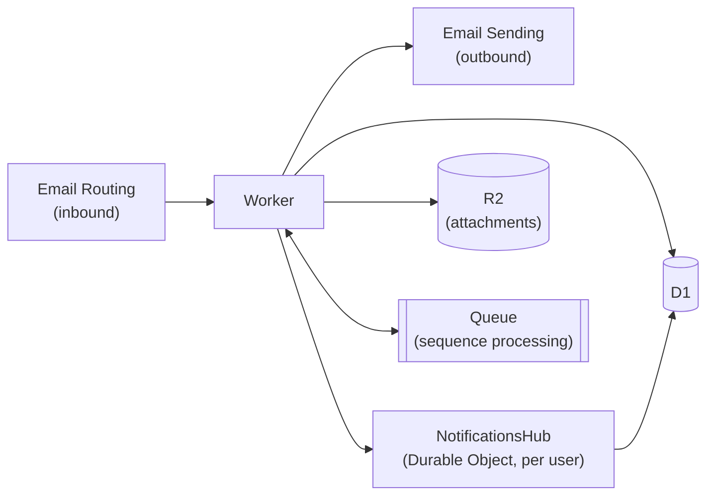

<p align="center">
  
</p>

<p align="center">
  <a href="https://github.com/choyiny/saasmail/actions/workflows/test.yml"></a>
  <a href="https://github.com/choyiny/saasmail/actions/workflows/e2e.yml"></a>
  <a href="https://github.com/choyiny/saasmail/actions/workflows/codeql.yml"></a>
  <a href="https://github.com/choyiny/saasmail/releases/latest"></a>
  <a href="LICENSE"></a>
  <a href="https://workers.cloudflare.com/"></a>
</p>

**The centralized inbox for SaaS teams.** One unified timeline per customer — marketing, notifications, and support emails collapsed into a single view, per person.

Every interaction with a customer matters, and context compounds. saasmail pulls the promo blast, the billing receipt, and the support thread into the same conversation, so anyone on your team can respond with the full history already in hand.

Self-hosted on Cloudflare Workers. Receive with **Cloudflare Email Workers**. Send with **Cloudflare Email Sending**, **Resend**, **Bavimail**, or **Postmark**.


## Who this is for

SaaS teams that want a self-hosted email stack on Cloudflare Workers — one shared, per-customer inbox for marketing, transactional, and support mail — without renting a VM or operating a traditional mail server. If you have a domain, a Cloudflare account, and want to own your customer email data for [~$5/month](#how-much-does-it-cost), this is for you.

## Quickstart

**Prerequisites:** a domain on Cloudflare with Email Routing available, the Workers Paid plan, and [Node.js](https://nodejs.org/) v18+.

The fastest path is the Claude Code onboarding skill — it provisions every Cloudflare resource, fills out your config, runs migrations, and deploys for you:

```bash
git clone https://github.com/choyiny/saasmail.git
cd saasmail
claude   # then run /saasmail-onboarding
```

**First successful result:** your worker is live at your domain, and visiting it prompts you to create the first admin account. Name an inbox, send yourself a test email, and watch it land on a customer timeline.

Prefer to wire it up by hand? See [Full setup](#full-setup) below (~8 steps).

## Architecture at a glance

```
Inbound    customer ─▶ Cloudflare Email Routing ─▶ saasmail Worker ─▶ D1 · R2 · Queue
Outbound   saasmail Worker ─▶ Email Sending / Resend / Bavimail / Postmark ─▶ customer
```

Everything runs inside a single Cloudflare Worker — no separate mail server to operate. See [Architecture](#architecture) for the full diagram and the component-by-component breakdown.

## Sponsors

<a href="https://givefeedback.dev/saas"></a>
GiveFeedback.dev uses AI to turn client screen recordings into actionable tasks and prevent scope creep.

## Demo Video

https://github.com/user-attachments/assets/fe3a3811-1902-4b0b-8b94-f8c72f1afab4

## Provider Matrix

|               | Cloudflare | Resend | Bavimail | Postmark |
| ------------- | ---------- | ------ | -------- | -------- |
| **Sending**   | ✅         | ✅     | ✅       | ✅       |
| **Receiving** | ✅         | ❌     | ❌       | ❌       |

Pick one outbound provider at deploy time:

- **Cloudflare Email Sending** — add a `send_email` binding (`EMAIL`) in `wrangler.jsonc` and onboard your domain at [Email Service](https://dash.cloudflare.com/?to=/:account/email-service).
- **Resend** — set `RESEND_API_KEY` as a secret.
- **Bavimail** — set `BAVIMAIL_API_KEY` and `BAVIMAIL_ALIAS_ID` as secrets. The alias ID identifies the sending alias configured in your Bavimail dashboard.
- **Postmark** — set `POSTMARK_API_KEY` as a secret (your Postmark server's API token). Verify each send-from domain in the Postmark dashboard.

Selection precedence at runtime: **Bavimail** (when both env vars are set) > **Postmark** (when `POSTMARK_API_KEY` is set) > **Resend** (when `RESEND_API_KEY` is set) > **Cloudflare Email Sending** (when the `EMAIL` binding exists). If none are configured, send attempts return a "No email provider configured" error.

## How much does it cost?

**$5/month** for the Cloudflare Workers Paid plan, which includes **3,000 emails per month** of Cloudflare Email Sending at no extra cost. That's it.

No VM to rent. No sprawling cloud console to learn. Just a domain, a Cloudflare account, and the Workers Paid plan.

## Features

### One Timeline Per Customer

Every email from a given person — marketing campaigns, transactional notifications, support replies — lands on a single timeline. People are sorted by recency with unread counts, so the customer who needs attention is always on top. Click in to see the latest message, and open the thread sidebar to replay the full history. Messages render as sanitized HTML with a Slack-style reply composer.

### Multi-Inbox with Team Permissions

Run multiple inbound addresses from a single deployment. Admins configure display names per inbox (`support@`, `sales@`, etc.) and assign members to specific inboxes. Members only see email, templates, and sequences scoped to the inboxes they're allowed to access.

### Thread or Chat, Per Inbox

Different inboxes call for different UX. Set each inbox to render as **Thread** or **Chat**:

- **Thread** — traditional email threading with subject lines, quoted history, and formatted HTML. The right fit for `marketing@` and `newsletters@`, where context lives inside the message.
- **Chat** — bubble-style conversation view that strips away subjects and signatures so replies feel like iMessage. The right fit for `support@`, where customers expect a back-and-forth, not a formal thread.

One deployment, one person timeline, but the interaction model matches the channel.

### Email Templates

Create reusable HTML email templates with `{{variable}}` interpolation. Edit templates with a live HTML editor, preview rendered output, and send them via the API or the UI. Variables are automatically extracted and validated before sending. Templates are scoped to allowed inboxes.

### Email Sequencing

Build multi-step drip campaigns. Enroll a contact into a sequence and saasmail sends templated emails on a schedule. Supports step skipping, delay overrides, custom variables, and automatic cancellation when the contact replies. Enrollment is enforced against the member's allowed inboxes.

### Suppressions and Unsubscribe

saasmail tracks unsubscribed and manually-suppressed recipients in a `suppressions` table. Suppression checks run on every outbound dispatch path: `POST /api/send`, scheduled sequence steps, and admin template test-sends. Admins manage the list at `/admin/suppressions` (CRUD also exposed at `/api/suppressions`).

- **List-Unsubscribe headers**: marketing sends automatically include `List-Unsubscribe` and `List-Unsubscribe-Post: List-Unsubscribe=One-Click` (RFC 8058) headers so Gmail/Yahoo bulk-sender rules and major mail clients render native unsubscribe affordances.
- **Unsubscribe footer**: templates can use `{{unsubscribe_url}}` in HTML or plaintext bodies. If the rendered output doesn't include the URL, saasmail auto-appends a minimal unsubscribe footer.
- **Unsubscribe page**: recipients land on `/unsubscribe?token=…`. The page POSTs to `/api/unsubscribe` on JavaScript mount (so URL-preview crawlers don't trigger it) and offers a "Re-subscribe" button. One-click unsubscribe (RFC 8058) also works via `POST /api/unsubscribe?token=…` directly — no session, no UI; the token signs the recipient's email.
- **Transactional sends**: account-critical mail (password resets, OTPs, system notifications) should pass `transactional: true` in the `POST /api/send` body. This bypasses the suppression check, skips the unsubscribe headers, and skips the footer auto-append. Anyone you genuinely _need_ to email will still get the message.

> **Behavior shift for API integrators**: `POST /api/send` now adds `List-Unsubscribe` headers and (if the body lacks the URL) appends an unsubscribe footer to every send UNLESS the caller passes `transactional: true`. If your integration sends password resets, OTPs, or other account-critical mail through `/api/send`, set the flag explicitly on those calls to preserve the previous behavior.

The Worker signs unsubscribe tokens with `UNSUBSCRIBE_SECRET` (see [Configuration](#devvars)) and builds absolute URLs from the existing `BASE_URL` setting.

### User Management

Admin-controlled onboarding via one-time invite links. New members sign up with email + password, and can register a passkey for passwordless login on subsequent sessions. Roles: `admin` (full access + user management) and `member` (scoped by inbox assignment).

### API Keys

Issue scoped API keys for programmatic access to send email, manage templates, enroll contacts in sequences, and query inbox data. Keys are hashed at rest and follow the `sk_…` format.

### Webhooks

POST to an external URL whenever a **new inbound message** is received — useful for help-desk automation (post to a team chat, trigger triage, draft a reply via n8n / Make / etc.).

- **Config:** Admins set a destination URL (and optional signing secret) on the **API keys** page. Global, single best-effort attempt, **disabled by default** (no URL = nothing fires). Any URL scheme is accepted, including `http://` for local automation.
- **Event:** one `message.received` per received message (deduped by `Message-ID`).
- **Security:** when a secret is set, each request includes `X-SaaSMail-Signature: sha256=<hmac>`, an HMAC-SHA256 of the raw request body. Verify it before trusting the payload.

Payload:

```json
{
  "event": "message.received",
  "id": "abc123",
  "receivedAt": 1717459200,
  "inbox": "support@yourdomain.com",
  "from": { "address": "customer@example.com", "name": "Jane Customer" },
  "subject": "Help with my order",
  "textPreview": "Hi, I can't log in…",
  "conversationId": "…",
  "attachments": [
    { "filename": "screenshot.png", "contentType": "image/png", "size": 20481 }
  ],
  "auth": { "spf": "pass", "dkim": "pass", "dmarc": "pass" },
  "url": "https://mail.yourdomain.com/m/abc123"
}
```

Verify the signature (Node example):

```js
import { createHmac, timingSafeEqual } from "node:crypto";

function verify(rawBody, header, secret) {
  const expected =
    "sha256=" + createHmac("sha256", secret).update(rawBody).digest("hex");
  const a = Buffer.from(header ?? "");
  const b = Buffer.from(expected);
  return a.length === b.length && timingSafeEqual(a, b);
}
```

## Architecture

| Layer               | Technology                                                                |
| ------------------- | ------------------------------------------------------------------------- |
| **Receive email**   | Cloudflare Email Workers                                                  |
| **Send email**      | Cloudflare Email Sending, Resend, Bavimail, or Postmark                   |
| **Runtime**         | Cloudflare Workers + Hono                                                 |
| **API**             | Zod + `@hono/zod-openapi` (OpenAPI 3.1)                                   |
| **Database**        | Cloudflare D1 (SQLite)                                                    |
| **File storage**    | Cloudflare R2 (attachments)                                               |
| **Queue**           | Cloudflare Queues (sequence processing)                                   |
| **Realtime + Push** | Durable Object (`NotificationsHub`, one per user) — WebSockets + Web Push |
| **Web Push**        | VAPID + `aes128gcm` payload encryption (RFC 8291), implemented in-worker  |
| **Service Worker**  | `public/sw.js` — receives push events, renders OS notifications           |
| **Cron**            | Hourly trigger for sequence email scheduling                              |
| **Frontend**        | React + Tailwind CSS + TipTap editor                                      |
| **ORM**             | Drizzle                                                                   |
| **Auth**            | BetterAuth with passkey support                                           |

### Architecture Diagram



The `NotificationsHub` Durable Object is keyed per user (`idFromName(userId)`). On inbound mail the worker fans out to each recipient's hub, which pushes WebSocket frames to live tabs and sends encrypted Web Push to registered devices. The queue carries scheduled sequence emails — the cron trigger enqueues due steps and a queue consumer in the same worker sends them.

## Full setup

### Recommended: install with Claude Code

saasmail ships with two [Claude Code](https://claude.ai/claude-code) skills that do the install and upgrade for you. This is the path we actively maintain — everything in the manual setup below is what the skills automate.

```bash
git clone https://github.com/choyiny/saasmail.git
cd saasmail
claude
```

Then, inside Claude Code:

- **`/saasmail-onboarding`** — interactive setup wizard. Walks you through Cloudflare login, creating D1/R2/Queue resources, filling out `wrangler.jsonc` and `.dev.vars`, running migrations, configuring Email Routing, and deploying. Expect ~30–40 minutes; most of that is DNS propagation, not typing.
- **`/update-saasmail`** — pull the latest upstream changes. Adds the `upstream` remote if missing, rebases your local commits on top, and resolves conflicts in favor of upstream so you don't get stuck. Run this anytime you want to sync with `choyiny/saasmail`.

Don't have Claude Code? The manual steps below cover the same ground.

### Manual setup

### Prerequisites

- [Node.js](https://nodejs.org/) v18+
- [Yarn](https://yarnpkg.com/)
- [Wrangler CLI](https://developers.cloudflare.com/workers/wrangler/) (`npm install -g wrangler`)
- A [Cloudflare](https://dash.cloudflare.com/) account with Email Routing available for your domain
- _Optional:_ a [Resend](https://resend.com/) account and API key (only if you prefer Resend over Cloudflare Email Sending)
- _Optional:_ a [Bavimail](https://bavimail.com/) account, API key, and alias ID (only if you prefer Bavimail)
- _Optional:_ a [Postmark](https://postmarkapp.com/) account and server API token (only if you prefer Postmark)

### 1. Clone and install

```bash
git clone https://github.com/choyiny/saasmail.git
cd saasmail
yarn install
```

### 2. Authenticate with Cloudflare

```bash
wrangler login
```

### 3. Create Cloudflare resources

```bash
# D1 database
wrangler d1 create saasmail-db

# R2 bucket
wrangler r2 bucket create saasmail-attachments

# Queue for email sequencing
wrangler queues create saasmail-sequence-emails
```

### 4. Configure wrangler

Copy the example config and fill in your values:

```bash
cp wrangler.jsonc.example wrangler.jsonc
```

Edit `wrangler.jsonc`:

- Set `account_id` to your Cloudflare account ID
- Set the `database_id` in `d1_databases` to the ID from step 3
- Set `BASE_URL` to your deployed URL
- Set `TRUSTED_ORIGINS` to include your deployed URL
- If using Cloudflare Email Sending, uncomment the `send_email` binding

### 5. Configure secrets

Copy the example and fill in your values:

```bash
cp .dev.vars.example .dev.vars
```

Edit `.dev.vars`:

- `BAVIMAIL_API_KEY` and `BAVIMAIL_ALIAS_ID` — your Bavimail bearer token and alias UUID (only if using Bavimail; both must be set)
- `POSTMARK_API_KEY` — your Postmark server API token (only if using Postmark)
- `RESEND_API_KEY` — your Resend API key (omit if using Cloudflare Email Sending, Bavimail, or Postmark)
- `BETTER_AUTH_SECRET` — generate a random string (`openssl rand -hex 32`)
- `UNSUBSCRIBE_SECRET` — generate a random string (`openssl rand -hex 32`); used to sign one-click unsubscribe tokens

For production, set these as Cloudflare secrets:

```bash
wrangler secret put BETTER_AUTH_SECRET
wrangler secret put UNSUBSCRIBE_SECRET
wrangler secret put RESEND_API_KEY      # only if using Resend
wrangler secret put BAVIMAIL_API_KEY    # only if using Bavimail
wrangler secret put BAVIMAIL_ALIAS_ID   # only if using Bavimail
wrangler secret put POSTMARK_API_KEY    # only if using Postmark
```

### 6. Run migrations

```bash
# Local development database
yarn db:migrate:dev

# Production database
yarn db:migrate:prod
```

Run the production migration before opening the deployed app for the first setup. If the production D1 database has not been initialized, the onboarding screen will show **Database migration required** with the same command.

### 7. Configure email routing

In the [Cloudflare dashboard](https://dash.cloudflare.com/), go to your domain's **Email Routing** settings and add a catch-all rule that routes to your saasmail worker.

### 8. Deploy

```bash
yarn deploy
```

Visit your deployed URL to create your first admin account. Once signed in, go to **Inboxes** to name your inbound addresses and **Users** to invite additional team members.

## Updating saasmail

### Recommended: `/update-saasmail`

From inside Claude Code, run **`/update-saasmail`**. It links the `upstream` remote to `https://github.com/choyiny/saasmail`, fetches the latest, and rebases your local commits on top. Any unresolvable conflicts are auto-resolved in favor of upstream so the sync never gets stuck.

### Manual

```bash
git remote add upstream https://github.com/choyiny/saasmail.git  # first time only
git fetch upstream
git rebase upstream/main -X ours
```

The `-X ours` flag tells rebase to prefer upstream for conflicting hunks (during a rebase, "ours" is the branch being rebased onto). Your local commits are still replayed on top.

## Local Development

```bash
# Start dev server (frontend + worker)
yarn dev

# Run tests
yarn test

# Type-check
yarn tsc --noEmit

# Generate a migration after schema changes
yarn db:generate

# Apply migrations locally
yarn db:migrate:dev

# Seed the local database with mock inboxes, people, and email threads
yarn db:seed:dev

# Open Drizzle Studio (local)
yarn db:studio:dev
```

Since Cloudflare Email Routing can't deliver to `wrangler dev`, the seed script populates `seeds/demo.sql` so you can exercise the inbox UI without real inbound email.

The API is generated from Zod schemas in `worker/src/routers/` and exposes an OpenAPI 3.1 spec at `/api/doc` in the running worker.

### End-to-end tests

Playwright drives the UI against a local `vite dev` running in demo mode (port 8788).

```bash
# Install Playwright browsers (first run only)
yarn playwright install chromium

# Run the full E2E suite (wipes and re-seeds the local D1 first)
yarn test:e2e

# Interactive runner
yarn test:e2e:ui

# Debug a single spec
yarn test:e2e e2e/specs/compose.spec.ts
```

The E2E suite **wipes and re-seeds the local D1 database** (`.wrangler/state/v3/d1/`) every time it runs. If you have hand-seeded dev data you want to keep, re-run `yarn db:seed:dev` after the E2E suite finishes.

Requirements in `.dev.vars`: `DEMO_MODE=1` and `DISABLE_PASSKEY_GATE=true` — both are in `.dev.vars.example`. The suite also expects `http://localhost:8788` in `TRUSTED_ORIGINS` in `wrangler.jsonc`.

## Configuration

### wrangler.jsonc

Your Cloudflare Workers configuration. Created from `wrangler.jsonc.example`. This file is gitignored so each deployer maintains their own config. Key sections:

- `d1_databases` — D1 database binding
- `r2_buckets` — R2 bucket for attachments
- `queues` — Queue for sequence email processing
- `triggers.crons` — Hourly cron to check for due sequence emails
- `send_email` (optional) — Binding for Cloudflare Email Sending
- `vars.BASE_URL` — Your deployed URL (used for OAuth redirects and BetterAuth)
- `vars.TRUSTED_ORIGINS` — CORS allowed origins
- `vars.COOKIE_PREFIX` — Prefix for better-auth session cookies
- `vars.VAPID_PUBLIC_KEY` / `vars.VAPID_SUBJECT` — public VAPID config for
  browser push notifications. Generate with `yarn vapid:generate` and store
  the private key via `wrangler secret put VAPID_PRIVATE_KEY`. Leave blank
  to disable push.

To rebrand the UI, drop a replacement `public/saasmail-logo.png` — it's used as both the favicon and the in-app logo. The `/saasmail-onboarding` skill will do this for you interactively.

### .dev.vars

Local development secrets. Created from `.dev.vars.example`. This file is gitignored.

- `BAVIMAIL_API_KEY` — Bavimail API bearer token (required for Bavimail, must be paired with `BAVIMAIL_ALIAS_ID`)
- `BAVIMAIL_ALIAS_ID` — Bavimail alias UUID identifying the sending alias (required for Bavimail)
- `POSTMARK_API_KEY` — Postmark server API token (if using Postmark)
- `RESEND_API_KEY` — Resend API key (if using Resend)
- `BETTER_AUTH_SECRET` — Secret for session signing
- `UNSUBSCRIBE_SECRET` — Secret used to HMAC-sign one-click unsubscribe tokens. Generate with `openssl rand -hex 32`. Set in prod via `wrangler secret put UNSUBSCRIBE_SECRET`. Required for the suppressions/unsubscribe feature.
- `DISABLE_PASSKEY_GATE` — Local-only: set to `"true"` to skip the server-side passkey requirement so you can sign in with email+password during development. **Never set this in production.**

## Roadmap

- **Agentic email steering** — AI-driven conversation flows that intelligently gather information from contacts through multi-turn email exchanges

## Contributing

See [CONTRIBUTING.md](CONTRIBUTING.md). All participants are expected to follow the [Code of Conduct](CODE_OF_CONDUCT.md). Security issues: see [SECURITY.md](SECURITY.md).

This repo ships a `CLAUDE.md` at the project root with a few notes the maintainer uses when pairing with [Claude Code](https://claude.ai/claude-code). It's harmless to ignore if you're not using Claude Code.

## License

[Apache License 2.0](LICENSE)

The name "saasmail" and the saasmail logo are used by the original project to identify it. You are free to fork and redistribute the source under the Apache 2.0 license, but please rename your fork (and replace `public/saasmail-logo.png`) if you run it as a branded product, so users aren't confused about which project they're installing.
