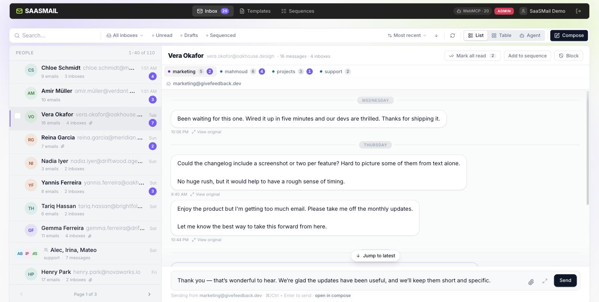
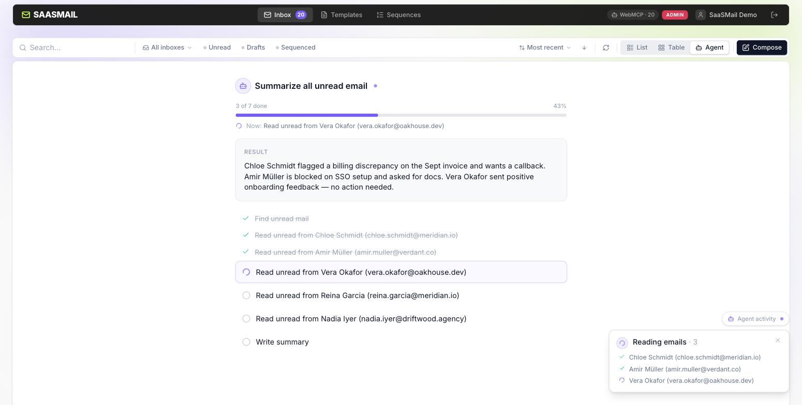
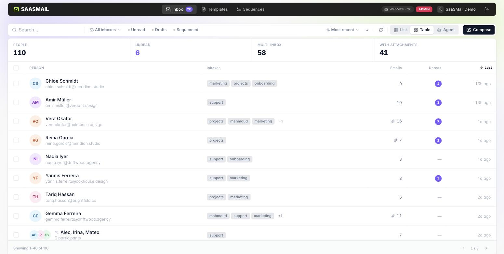
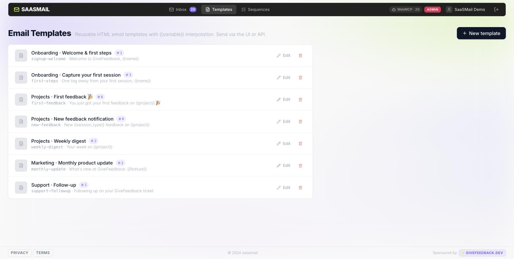
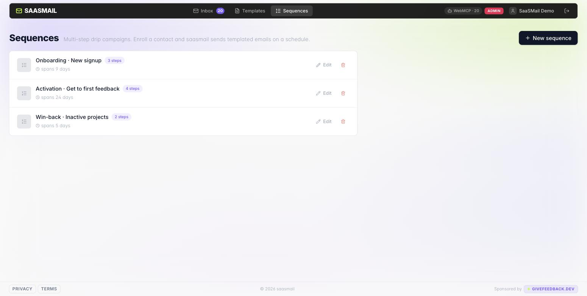
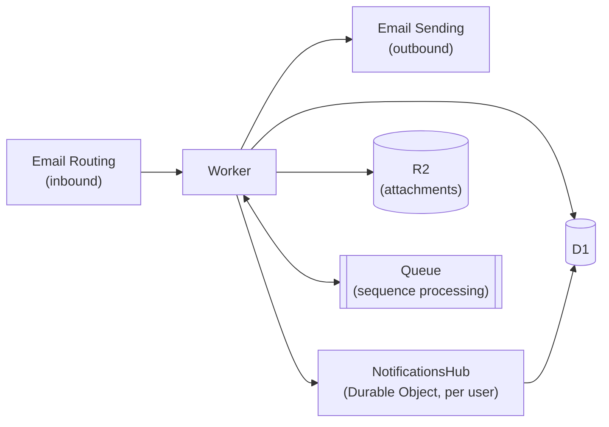

<p align="center">
  
</p>

<p align="center">
  <a href="https://github.com/choyiny/saasmail/actions/workflows/test.yml"></a>
  <a href="https://github.com/choyiny/saasmail/actions/workflows/e2e.yml"></a>
  <a href="https://github.com/choyiny/saasmail/actions/workflows/codeql.yml"></a>
  <a href="https://github.com/choyiny/saasmail/releases/latest"></a>
  <a href="LICENSE"></a>
  <a href="https://workers.cloudflare.com/"></a>
</p>

**The centralized inbox for SaaS teams.** One unified timeline per customer — marketing, notifications, and support emails collapsed into a single view, per person.

Every interaction with a customer matters, and context compounds. saasmail pulls the promo blast, the billing receipt, and the support thread into the same conversation, so anyone on your team can respond with the full history already in hand.

Self-hosted on Cloudflare Workers. Receive with **Cloudflare Email Workers**. Send with **Cloudflare Email Sending**, **Resend**, **Bavimail**, or **Postmark**.


## Who this is for

SaaS teams that want a self-hosted email stack on Cloudflare Workers — one shared, per-customer inbox for marketing, transactional, and support mail — without renting a VM or operating a traditional mail server. If you have a domain, a Cloudflare account, and want to own your customer email data for [~$5/month](#how-much-does-it-cost), this is for you.

## Quickstart

**Prerequisites:** a domain on Cloudflare with Email Routing available, the Workers Paid plan, and [Node.js](https://nodejs.org/) v18+.

The fastest path is the Claude Code onboarding skill — it provisions every Cloudflare resource, fills out your config, runs migrations, and deploys for you:

```bash
git clone https://github.com/choyiny/saasmail.git
cd saasmail
claude   # then run /saasmail-onboarding
```

**First successful result:** your worker is live at your domain, and visiting it prompts you to create the first admin account. Name an inbox, send yourself a test email, and watch it land on a customer timeline.

Prefer to wire it up by hand? See [Full setup](#full-setup) below (~8 steps).

## Architecture at a glance

```
Inbound    customer ─▶ Cloudflare Email Routing ─▶ saasmail Worker ─▶ D1 · R2 · Queue
Outbound   saasmail Worker ─▶ Email Sending / Resend / Bavimail / Postmark ─▶ customer
```

Everything runs inside a single Cloudflare Worker — no separate mail server to operate. See [Architecture](#architecture) for the full diagram and the component-by-component breakdown.

## Sponsors

<a href="https://givefeedback.dev/saas"></a>
GiveFeedback.dev uses AI to turn client screen recordings into actionable tasks and prevent scope creep.

## Demo Video

One person's mail across four inboxes, collapsed into a single timeline — filter by inbox and reply inline.

<video src="https://github.com/choyiny/saasmail/raw/main/docs/saasmail-demo.mp4" controls muted loop playsinline width="100%">
  <a href="https://github.com/choyiny/saasmail/raw/main/docs/saasmail-demo.mp4">Watch the saasmail demo</a>
</video>

## Screenshots

**One timeline per customer** — every inbox a person has emailed collapses into a single conversation, with per-inbox tabs and a chat-style composer.



**Agent Plan (WebMCP)** — connect a browser AI agent and watch it work the inbox: it reads a playbook, lays out a live plan, and ticks steps off while a bottom-right feed groups each tool call as it runs.



**Table overview** — stat tiles plus a sortable people table spanning every inbox, with unread and attachment indicators.



**Templates & sequences** — reusable `{{variable}}` email templates and multi-step drip campaigns you enroll contacts into.





## Provider Matrix

|               | Cloudflare | Resend | Bavimail | Postmark |
| ------------- | ---------- | ------ | -------- | -------- |
| **Sending**   | ✅         | ✅     | ✅       | ✅       |
| **Receiving** | ✅         | ❌     | ❌       | ❌       |

Pick one outbound provider at deploy time:

- **Cloudflare Email Sending** — add a `send_email` binding (`EMAIL`) in `wrangler.jsonc` and onboard your domain at [Email Service](https://dash.cloudflare.com/?to=/:account/email-service).
- **Resend** — set `RESEND_API_KEY` as a secret.
- **Bavimail** — set `BAVIMAIL_API_KEY` and `BAVIMAIL_ALIAS_ID` as secrets. The alias ID identifies the sending alias configured in your Bavimail dashboard.
- **Postmark** — set `POSTMARK_API_KEY` as a secret (your Postmark server's API token). Verify each send-from domain in the Postmark dashboard.

Selection precedence at runtime: **Bavimail** (when both env vars are set) > **Postmark** (when `POSTMARK_API_KEY` is set) > **Resend** (when `RESEND_API_KEY` is set) > **Cloudflare Email Sending** (when the `EMAIL` binding exists). If none are configured, send attempts return a "No email provider configured" error.

## How much does it cost?

**$5/month** for the Cloudflare Workers Paid plan, which includes **3,000 emails per month** of Cloudflare Email Sending at no extra cost. That's it.

No VM to rent. No sprawling cloud console to learn. Just a domain, a Cloudflare account, and the Workers Paid plan.

## Features

### One Timeline Per Customer

Every email from a given person — marketing campaigns, transactional notifications, support replies — lands on a single timeline. People are sorted by recency with unread counts, so the customer who needs attention is always on top. Click in to see the latest message, and open the thread sidebar to replay the full history. Messages render as sanitized HTML with a Slack-style reply composer.

### Multi-Inbox with Team Permissions

Run multiple inbound addresses from a single deployment. Admins configure display names per inbox (`support@`, `sales@`, etc.) and assign members to specific inboxes. Members only see email, templates, and sequences scoped to the inboxes they're allowed to access.

### Thread or Chat, Per Inbox

Different inboxes call for different UX. Set each inbox to render as **Thread** or **Chat**:

- **Thread** — traditional email threading with subject lines, quoted history, and formatted HTML. The right fit for `marketing@` and `newsletters@`, where context lives inside the message.
- **Chat** — bubble-style conversation view that strips away subjects and signatures so replies feel like iMessage. The right fit for `support@`, where customers expect a back-and-forth, not a formal thread.

One deployment, one person timeline, but the interaction model matches the channel.

### Per-Inbox Forwarding

Give any inbox a **Forward to** address and every message it receives is re-sent to
that address. Configured per inbox on the **Inboxes** page, right next to display
name, signature, mode, and member permissions. Off by default.

**Why not just use a Cloudflare Email Routing forwarding rule?** Because Email
Routing relays forwarded mail from a shared IP pool that Outlook, Hotmail, and Live
blocklist. Forwards to a Microsoft-hosted mailbox come back as:

```
permanent error (550): 5.7.1 Unfortunately, messages from [104.30.10.66] weren't
sent. Please contact your Internet service provider since part of their network is
on our block list (S3150).
```

That IP belongs to Cloudflare, not to you, so there is no delisting path. saasmail
sidesteps it by sending the copy itself through your configured outbound provider —
different IPs, and DKIM-signed for your own domain, so it authenticates cleanly.

How the forwarded copy looks:

- **From** the inbox address, with the original sender named in the display name
  (`"Jane Customer (via Acme Support)" <support@acme.com>`). It cannot keep the
  original `From:` — sending as `jane@example.com` from your infrastructure would
  fail SPF and DMARC and get filtered harder than the block being avoided.
- **Reply-To** the original sender, so replying reaches the customer.
- Original `From` / `Date` / `Subject` / `Cc` and the SPF/DKIM/DMARC verdicts are
  restated in a header block at the top of the body.
- Attachments are included, up to your provider's size ceiling; anything too large
  is named in the body rather than silently dropped. Inline images arrive as regular
  attachments.
- The original `Cc` recipients are **not** re-sent to — only the destination is.

Forwarding is best-effort and never blocks inbound mail: it runs after the message
is safely stored, and after the blocklist and duplicate checks, so blocked senders
and duplicate deliveries are never forwarded. There is no retry — failures are
logged. Loops are prevented three ways: an inbox can't forward to itself, can't
forward to another inbox on the same instance, and any message already carrying the
`X-SaaSMail-Forwarded-For` header is never forwarded again.

### Email Templates

Create reusable HTML email templates with `{{variable}}` interpolation. Edit templates with a live HTML editor, preview rendered output, and send them via the API or the UI. Top-level variables are automatically extracted and validated before sending — a send that omits one is rejected with `400` rather than mailing a half-rendered template. Templates are scoped to allowed inboxes.

**Validation covers top-level names only.** Names used inside a `{{#section}}`
body are _not_ validated, because they resolve against the current item at
render time rather than against what the caller passed. An unresolved name
inside a section renders **empty**; only the section's own name is required.

`GET /api/email-templates/{slug}/variables` returns three lists:

- `variables` — top-level names the caller must supply, or the send fails.
  This is the send contract; its shape and meaning are unchanged.
- `optional` — names that render empty when absent: `{{key?}}` tags and
  inverted (`{{^key}}`) section names.
- `sections` — each section's name, whether it's inverted, and the names its
  body references. Those body names resolve per item at render time and are
  never part of `variables`, even though the response now surfaces them for
  the editor and API callers building a form around a template.

#### Template syntax

| Tag                  | Behavior                                                   |
| -------------------- | ---------------------------------------------------------- |
| `{{key}}`            | Value, HTML-escaped in the body; plain text in the subject |
| `{{{key}}}`          | Value, raw — for pre-rendered HTML                         |
| `{{key?}}`           | Optional; renders empty instead of failing the send        |
| `{{key\|nl2br}}`     | Escaped, then newlines become `<br>`                       |
| `{{#key}}…{{/key}}`  | Renders if truthy; iterates arrays                         |
| `{{#key?}}…{{/key}}` | Same as `{{#key}}`, but doesn't fail the send if missing   |
| `{{^key}}…{{/key}}`  | Renders if falsy or empty                                  |
| `{{.}}`              | Current item inside an array-of-strings section            |

```html
{{#items}}
<tr>
  <td>{{name}}</td>
  <td>{{currency}}{{price}}</td>
</tr>
{{/items}} {{^items}}
<p>Nothing to show yet.</p>
{{/items}}
```

Names inside a section resolve against the current item first, then fall back
to the top level — so `{{currency}}` above can live outside `items`. A name a
section body cannot resolve renders empty; it is not reported as missing,
because only the section's own name (`items`) is a caller contract.

A tag name is a run of word characters (or a bare `.`), with no spaces inside
the braces. Anything else — `{{ spaced }}`, `{{user.name}}`, `{{not-a-var}}` —
is left alone as literal text, exactly as before the rewrite, so prose that
happens to contain braces is never mistaken for a variable. Sections may nest
up to 64 levels.

An unbalanced or mismatched section tag is a **parse error**: the request
fails with `400` and a diagnostic naming the offending tag, rather than
sending something half-formed. This affects
`POST /api/email-templates/{slug}/send`,
`GET /api/email-templates/{slug}/variables`, and `POST /api/send/reply/{id}`.
A sequence step whose template does not parse is marked `failed`.

The `variables` payload itself — the JSON you POST, not the template markup —
may nest objects and arrays up to 32 levels deep. A payload nested deeper than
that is rejected with `400` naming the limit, rather than risking a stack
overflow while validating it. This is independent of the 64-level cap on
section nesting above: one bounds the data you send, the other bounds the
template you write.

The template editor's UI understands this grammar too — grouping detected
variables into Required, Optional, and Sections, and rendering a live preview
with sample values in place of the raw tokens — so what you see while editing
matches what a real send does.

##### Upgrading: escaping is now the default

Variables were previously substituted raw. They are now HTML-escaped in the
body, so a value containing markup renders as text rather than as HTML. The
subject line is a plain-text header, not HTML, so values substituted there are
passed through unchanged — as they always have been.

**If any of your templates deliberately pass HTML through a variable, change
those tags from `{{key}}` to `{{{key}}}` before upgrading.** Templates whose
variables carry plain text need no change.

One related consequence: because `{{{key}}}` now means raw output, any run of
three or more consecutive braces is read differently than before. `{{{name}}}`
used to render as `{` followed by the substituted value followed by `}`; it is
now an unescaped substitution. This only affects templates that stack braces
against a tag — ordinary `{{key}}` tags in ordinary text are untouched.

This also applies to sequence sends, which share the same renderer.
Multi-line values still collapse in HTML — use `{{key|nl2br}}`, or wrap the
block in `style="white-space: pre-line"`.

### Email Sequencing

Build multi-step drip campaigns. Enroll a contact into a sequence and saasmail sends templated emails on a schedule. Supports step skipping, delay overrides, custom variables, and automatic cancellation when the contact replies. Enrollment is enforced against the member's allowed inboxes.

### Suppressions and Unsubscribe

saasmail tracks unsubscribed and manually-suppressed recipients in a `suppressions` table. Suppression checks run on every outbound dispatch path: `POST /api/send`, scheduled sequence steps, and admin template test-sends. Admins manage the list at `/admin/suppressions` (CRUD also exposed at `/api/suppressions`).

- **List-Unsubscribe headers**: marketing sends automatically include `List-Unsubscribe` and `List-Unsubscribe-Post: List-Unsubscribe=One-Click` (RFC 8058) headers so Gmail/Yahoo bulk-sender rules and major mail clients render native unsubscribe affordances.
- **Unsubscribe footer**: templates can use `{{unsubscribe_url}}` in HTML or plaintext bodies. If the rendered output doesn't include the URL, saasmail auto-appends a minimal unsubscribe footer.
- **Unsubscribe page**: recipients land on `/unsubscribe?token=…`. The page POSTs to `/api/unsubscribe` on JavaScript mount (so URL-preview crawlers don't trigger it) and offers a "Re-subscribe" button. One-click unsubscribe (RFC 8058) also works via `POST /api/unsubscribe?token=…` directly — no session, no UI; the token signs the recipient's email.
- **Transactional sends**: account-critical mail (password resets, OTPs, system notifications) should pass `transactional: true` in the `POST /api/send` body. This bypasses the suppression check, skips the unsubscribe headers, and skips the footer auto-append. Anyone you genuinely _need_ to email will still get the message.

> **Behavior shift for API integrators**: `POST /api/send` now adds `List-Unsubscribe` headers and (if the body lacks the URL) appends an unsubscribe footer to every send UNLESS the caller passes `transactional: true`. If your integration sends password resets, OTPs, or other account-critical mail through `/api/send`, set the flag explicitly on those calls to preserve the previous behavior.

The Worker signs unsubscribe tokens with `UNSUBSCRIBE_SECRET` (see [Configuration](#devvars)) and builds absolute URLs from the existing `BASE_URL` setting.

### User Management

Admin-controlled onboarding via one-time invite links. New members sign up with email + password, and can register a passkey for passwordless login on subsequent sessions. Roles: `admin` (full access + user management) and `member` (scoped by inbox assignment).

### API Keys

Issue scoped API keys for programmatic access to send email, manage templates, enroll contacts in sequences, and query inbox data. Keys are hashed at rest and follow the `sk_…` format.

### MCP Server (AI assistant access)

Connect Claude, or any other MCP client, directly to your inbox. saasmail
exposes a [Model Context Protocol](https://modelcontextprotocol.io) endpoint at
`/mcp` over streamable HTTP, secured with OAuth 2.1.

There is nothing to pre-register. The client discovers the authorization
server, registers itself (RFC 7591), and sends you through a normal browser
login plus a consent screen listing exactly what it is asking for. Approve it
and the client gets a scoped token.

#### Connecting a client

**Claude Code**

```bash
claude mcp add --transport http saasmail https://your-domain.com/mcp
```

Then run `/mcp` inside Claude Code and choose `saasmail` to finish the browser
login. Add `--scope user` to the command to make the connection available in
every project rather than only the current one.

**claude.ai** — Settings → Connectors → add a custom connector pointing at
`https://your-domain.com/mcp`. On Team and Enterprise plans, only admins can
add connectors.

**Any other MCP client** — point it at `https://your-domain.com/mcp` and choose
streamable HTTP as the transport. Clients configured by file usually want:

```json
{
  "mcpServers": {
    "saasmail": {
      "type": "http",
      "url": "https://your-domain.com/mcp"
    }
  }
}
```

`"streamable-http"` is accepted as a synonym for `"http"`.

#### Naming the connection

The server identifies itself with this instance's **brand name** (Settings →
brand name, the `brand_name` app setting; defaults to `saasmail`), both in the
MCP handshake and as `resource_name` in its OAuth discovery document. Set a
distinct brand name on each instance and clients that name a connector from
discovery will keep two saasmail deployments apart.

Clients that ask _you_ for the name still win: the `saasmail` in
`claude mcp add … saasmail …` and the key in the `mcpServers` block above are
local labels. Change those too when you connect more than one instance.

#### Prerequisites

Two settings (see [Configuration](#devvars)) must be right, or the handshake
fails in ways that are hard to read:

- **`BASE_URL` must exactly match the URL you hand the client** — same scheme
  and host, no trailing slash. Every OAuth identifier derives from it, and a
  token's audience is fixed at the moment it is issued. Connect to
  `https://www.example.com/mcp` while `BASE_URL` says `https://example.com` and
  tokens get minted for one identity and verified against another, so every
  call returns 401.
- **`BETTER_AUTH_SECRET` must be set.** It protects the OAuth signing keys.

To check the endpoint is reachable and discovery is wired up before involving a
client at all:

```bash
curl https://your-domain.com/.well-known/oauth-protected-resource/mcp
```

That returns the resource metadata (audience, authorization server, supported
scopes). An unauthenticated `POST /mcp` should return `401` with a
`WWW-Authenticate` header pointing back at that same document — that is the
handshake working, not an error.

#### Scopes

Three scopes gate what a connected client may do:

| Scope          | Grants                                                             |
| -------------- | ------------------------------------------------------------------ |
| `email:read`   | `whoami`, `list_people`, `get_person`, `list_emails`, `read_email` |
| `email:send`   | `send_template`, `enroll_sequence`                                 |
| `email:manage` | `mark_read`, `delete_email`                                        |

**Access is scoped to the connecting user.** A client acting for a member with
access to one inbox sees only that inbox — the same permission model as the web
UI and the HTTP API, enforced by the same code. Admins see everything. A passkey
is required, the same as for the web API.

**Prefer `email:read` alone.** An assistant connected to a mailbox reads
attacker-authored content by definition — anyone can email you. Granting
`email:send` or `email:manage` alongside it means a message in your inbox can
try to instruct the assistant to mail your data somewhere or delete it. The
consent screen flags those two scopes for this reason, and `delete_email` is
permanent (there is no trash). Grant them only to clients you actually trust.

**Revoking access.** Admins can list connected OAuth clients and cut them off at
**Settings → OAuth apps** (`GET /api/oauth-apps`, `DELETE /api/oauth-apps/{clientId}`).
Revocation takes effect on the client's next call: the MCP endpoint checks the
client on every request, so a revoked connection cannot keep working until its
token expires. Banning a user has the same immediate effect.

Any client can register itself (that is how MCP connectors work), so the list is
also where you spot one you don't recognise.

### WebMCP support (in-page AI agent access)

Separate from the `/mcp` server above, saasmail also implements
[WebMCP](https://github.com/webmachinelearning/webmcp) — a W3C proposal that
lets a page register tools directly on `document.modelContext` /
`navigator.modelContext` for an AI agent already embedded in the browser to
discover and call. There is no server endpoint and no OAuth flow: the tools
run client-side, in the same tab as the logged-in user, using their existing
session cookie.

**How it differs from `/mcp`:**

|               | `/mcp` (remote)                      | WebMCP (in-page)                                                                                                   |
| ------------- | ------------------------------------ | ------------------------------------------------------------------------------------------------------------------ |
| Runs          | Server, any MCP client, any location | In the open browser tab                                                                                            |
| Auth          | OAuth 2.1, scoped token              | Existing browser session cookie                                                                                    |
| Access        | Whatever the token's scopes allow    | Whatever the logged-in user can do                                                                                 |
| Sends/deletes | Scope-gated, no extra confirmation   | Staged, then require human confirmation in the UI                                                                  |
| Effect        | Calls the HTTP API directly          | Reads via the same API client; actions drive the visible UI (navigation, the compose drawer, filtered inbox views) |

Both exist side by side — `/mcp` is for external agents connecting to your
inbox from anywhere; WebMCP is for an agent already inside the page, acting as
the signed-in user.

**Trying it:** WebMCP is early and not yet in a browser by default. Two ways
to test it today:

- **Chrome 149+** — enable `chrome://flags/#enable-webmcp-testing`, then sign
  in to saasmail and open a conversation with a page-aware agent.
- **ChatGPT's in-app browser** — open your saasmail instance inside it while
  signed in.

If neither the native `document.modelContext` API nor `navigator.modelContext`
is present, saasmail falls back to loading the
[`@mcp-b/global`](https://www.npmjs.com/package/@mcp-b/global) polyfill so the
same tools still register.

**Safety model:**

- **Session-scoped.** The agent can only do what the signed-in user's session
  already permits — there is no separate credential or elevated access.
- **Never sends or deletes.** WebMCP is read + draft + navigate only. It has
  no send or delete tool: `compose_email`, `compose_from_template`, and
  `reply_email` produce drafts the signed-in user reviews and sends by hand —
  the agent cannot dispatch or destroy mail on its own.
- **Watchable.** A bottom-right activity popup surfaces each tool call as it
  runs (running → done/error), so the agent's work is visible rather than
  happening on an idle screen.
- **Per-instance toggle.** Set the `app_settings` row with key
  `webmcp_enabled` to the string `false` to stop the UI from registering any
  WebMCP tools; it is exposed to the frontend as `webmcpEnabled` on
  `GET /api/config` and defaults to `true` when unset.

**Tool list (20 total: 12 read, 8 action).** Read tools return data through
the same `/api` client the UI already uses. Action tools drive the real UI —
they navigate, open the compose drawer pre-filled, save a reply draft into the
inbox Drafts filter, enroll a contact and switch to the Sequenced view, or
render the agent's live plan on the Agent Plan tab — rather than calling a
write endpoint directly. `get_playbook` is the entry point: it returns how to
operate the inbox plus step-by-step plans for common workflows (summarize
unread, reply to unread, enroll contacts by criteria).

Read: `get_playbook`, `whoami`, `list_inboxes`, `list_conversations`,
`list_contacts`, `get_contact`, `list_emails`, `read_email`, `search_emails`,
`list_templates`, `get_template`, `list_sequences`.

Action: `open_contact`, `compose_email`, `compose_from_template`,
`reply_email`, `mark_read`, `mark_unread`, `enroll_in_sequence`,
`visualize_plan`.

### Webhooks

POST to an external URL whenever a **new inbound message** is received — useful for help-desk automation (post to a team chat, trigger triage, draft a reply via n8n / Make / etc.).

- **Config:** Admins set a destination URL (and optional signing secret) on the **API keys** page. Global, single best-effort attempt, **disabled by default** (no URL = nothing fires). Any URL scheme is accepted, including `http://` for local automation.
- **Event:** one `message.received` per received message (deduped by `Message-ID`).
- **Security:** when a secret is set, each request includes `X-SaaSMail-Signature: sha256=<hmac>`, an HMAC-SHA256 of the raw request body. Verify it before trusting the payload.

Payload:

```json
{
  "event": "message.received",
  "id": "abc123",
  "receivedAt": 1717459200,
  "inbox": "support@yourdomain.com",
  "from": { "address": "customer@example.com", "name": "Jane Customer" },
  "subject": "Help with my order",
  "textPreview": "Hi, I can't log in…",
  "conversationId": "…",
  "attachments": [
    { "filename": "screenshot.png", "contentType": "image/png", "size": 20481 }
  ],
  "auth": { "spf": "pass", "dkim": "pass", "dmarc": "pass" },
  "url": "https://mail.yourdomain.com/m/abc123"
}
```

Verify the signature (Node example):

```js
import { createHmac, timingSafeEqual } from "node:crypto";

function verify(rawBody, header, secret) {
  const expected =
    "sha256=" + createHmac("sha256", secret).update(rawBody).digest("hex");
  const a = Buffer.from(header ?? "");
  const b = Buffer.from(expected);
  return a.length === b.length && timingSafeEqual(a, b);
}
```

## Architecture

| Layer               | Technology                                                                |
| ------------------- | ------------------------------------------------------------------------- |
| **Receive email**   | Cloudflare Email Workers                                                  |
| **Send email**      | Cloudflare Email Sending, Resend, Bavimail, or Postmark                   |
| **Runtime**         | Cloudflare Workers + Hono                                                 |
| **API**             | Zod + `@hono/zod-openapi` (OpenAPI 3.0)                                   |
| **Database**        | Cloudflare D1 (SQLite)                                                    |
| **File storage**    | Cloudflare R2 (attachments)                                               |
| **Queue**           | Cloudflare Queues (sequence processing)                                   |
| **Realtime + Push** | Durable Object (`NotificationsHub`, one per user) — WebSockets + Web Push |
| **Web Push**        | VAPID + `aes128gcm` payload encryption (RFC 8291), implemented in-worker  |
| **Service Worker**  | `public/sw.js` — receives push events, renders OS notifications           |
| **Cron**            | Hourly trigger for sequence email scheduling                              |
| **Frontend**        | React + Tailwind CSS + TipTap editor                                      |
| **ORM**             | Drizzle                                                                   |
| **Auth**            | BetterAuth with passkey support                                           |

### Architecture Diagram


```mermaid
flowchart LR
    EmailRouting["Email Routing<br/>(inbound)"]
    EmailSending["Email Sending<br/>(outbound)"]

    Worker["Worker"]
    DO["NotificationsHub<br/>(Durable Object, per user)"]

    D1[("D1")]
    R2[("R2<br/>(attachments)")]
    Q[["Queue<br/>(sequence processing)"]]

    EmailRouting --> Worker
    Worker --> EmailSending
    Worker --> DO
    Worker --> D1
    Worker --> R2
    Worker <--> Q
    DO --> D1
```

The `NotificationsHub` Durable Object is keyed per user (`idFromName(userId)`). On inbound mail the worker fans out to each recipient's hub, which pushes WebSocket frames to live tabs and sends encrypted Web Push to registered devices. The queue carries scheduled sequence emails — the cron trigger enqueues due steps and a queue consumer in the same worker sends them.

## Full setup

### Recommended: install with Claude Code

saasmail ships with two [Claude Code](https://claude.ai/claude-code) skills that do the install and upgrade for you. This is the path we actively maintain — everything in the manual setup below is what the skills automate.

```bash
git clone https://github.com/choyiny/saasmail.git
cd saasmail
claude
```

Then, inside Claude Code:

- **`/saasmail-onboarding`** — interactive setup wizard. Walks you through Cloudflare login, creating D1/R2/Queue resources, filling out `wrangler.jsonc` and `.dev.vars`, running migrations, configuring Email Routing, and deploying. Expect ~30–40 minutes; most of that is DNS propagation, not typing.
- **`/update-saasmail`** — pull the latest upstream changes. Adds the `upstream` remote if missing, rebases your local commits on top, and resolves conflicts in favor of upstream so you don't get stuck. Run this anytime you want to sync with `choyiny/saasmail`.

Don't have Claude Code? The manual steps below cover the same ground.

### Manual setup

### Prerequisites

- [Node.js](https://nodejs.org/) v18+
- [Yarn](https://yarnpkg.com/)
- [Wrangler CLI](https://developers.cloudflare.com/workers/wrangler/) (`npm install -g wrangler`)
- A [Cloudflare](https://dash.cloudflare.com/) account with Email Routing available for your domain
- _Optional:_ a [Resend](https://resend.com/) account and API key (only if you prefer Resend over Cloudflare Email Sending)
- _Optional:_ a [Bavimail](https://bavimail.com/) account, API key, and alias ID (only if you prefer Bavimail)
- _Optional:_ a [Postmark](https://postmarkapp.com/) account and server API token (only if you prefer Postmark)

### 1. Clone and install

```bash
git clone https://github.com/choyiny/saasmail.git
cd saasmail
yarn install
```

### 2. Authenticate with Cloudflare

```bash
wrangler login
```

### 3. Create Cloudflare resources

```bash
# D1 database
wrangler d1 create saasmail-db

# R2 bucket
wrangler r2 bucket create saasmail-attachments

# Queue for email sequencing
wrangler queues create saasmail-sequence-emails
```

### 4. Configure wrangler

Copy the example config and fill in your values:

```bash
cp wrangler.jsonc.example wrangler.jsonc
```

Edit `wrangler.jsonc`:

- Set `account_id` to your Cloudflare account ID
- Set the `database_id` in `d1_databases` to the ID from step 3
- Set `BASE_URL` to your deployed URL
- Set `TRUSTED_ORIGINS` to include your deployed URL
- If using Cloudflare Email Sending, uncomment the `send_email` binding

### 5. Configure secrets

Copy the example and fill in your values:

```bash
cp .dev.vars.example .dev.vars
```

Edit `.dev.vars`:

- `BAVIMAIL_API_KEY` and `BAVIMAIL_ALIAS_ID` — your Bavimail bearer token and alias UUID (only if using Bavimail; both must be set)
- `POSTMARK_API_KEY` — your Postmark server API token (only if using Postmark)
- `RESEND_API_KEY` — your Resend API key (omit if using Cloudflare Email Sending, Bavimail, or Postmark)
- `BETTER_AUTH_SECRET` — **required**; generate a random string (`openssl rand -hex 32`). Signs sessions and protects the OAuth signing keys used by the MCP endpoint. Set this before deploying: without it the auth library silently falls back to a publicly known default value.
- `UNSUBSCRIBE_SECRET` — generate a random string (`openssl rand -hex 32`); used to sign one-click unsubscribe tokens

For production, set these as Cloudflare secrets:

```bash
wrangler secret put BETTER_AUTH_SECRET
wrangler secret put UNSUBSCRIBE_SECRET
wrangler secret put RESEND_API_KEY      # only if using Resend
wrangler secret put BAVIMAIL_API_KEY    # only if using Bavimail
wrangler secret put BAVIMAIL_ALIAS_ID   # only if using Bavimail
wrangler secret put POSTMARK_API_KEY    # only if using Postmark
```

### 6. Run migrations

```bash
# Local development database
yarn db:migrate:dev

# Production database
yarn db:migrate:prod
```

Run the production migration before opening the deployed app for the first setup. If the production D1 database has not been initialized, the onboarding screen will show **Database migration required** with the same command.

### 7. Configure email routing

In the [Cloudflare dashboard](https://dash.cloudflare.com/), go to your domain's **Email Routing** settings and add a catch-all rule that routes to your saasmail worker.

### 8. Deploy

```bash
yarn deploy
```

Visit your deployed URL to create your first admin account. Once signed in, go to **Inboxes** to name your inbound addresses and **Users** to invite additional team members.

## Updating saasmail

### Recommended: `/update-saasmail`

From inside Claude Code, run **`/update-saasmail`**. It links the `upstream` remote to `https://github.com/choyiny/saasmail`, fetches the latest, and rebases your local commits on top. Any unresolvable conflicts are auto-resolved in favor of upstream so the sync never gets stuck.

### Manual

```bash
git remote add upstream https://github.com/choyiny/saasmail.git  # first time only
git fetch upstream
git rebase upstream/main -X ours
```

The `-X ours` flag tells rebase to prefer upstream for conflicting hunks (during a rebase, "ours" is the branch being rebased onto). Your local commits are still replayed on top.

## Local Development

```bash
# Start dev server (frontend + worker)
yarn dev

# Run tests
yarn test

# Type-check
yarn tsc --noEmit

# Generate a migration after schema changes
yarn db:generate

# Apply migrations locally
yarn db:migrate:dev

# Seed the local database with mock inboxes, people, and email threads
yarn db:seed:dev

# Open Drizzle Studio (local)
yarn db:studio:dev
```

Since Cloudflare Email Routing can't deliver to `wrangler dev`, the seed script populates `seeds/demo.sql` so you can exercise the inbox UI without real inbound email.

The API is generated from Zod schemas in `worker/src/routers/`. Each running worker exposes an OpenAPI 3.0 spec at `/doc` (JSON) and an interactive explorer at `/swagger-ui`. Both are public — no auth required to read the spec.

### End-to-end tests

Playwright drives the UI against a local `vite dev` running in demo mode (port 8788).

```bash
# Install Playwright browsers (first run only)
yarn playwright install chromium

# Run the full E2E suite (wipes and re-seeds the local D1 first)
yarn test:e2e

# Interactive runner
yarn test:e2e:ui

# Debug a single spec
yarn test:e2e e2e/specs/compose.spec.ts
```

The E2E suite **wipes and re-seeds the local D1 database** (`.wrangler/state/v3/d1/`) every time it runs. If you have hand-seeded dev data you want to keep, re-run `yarn db:seed:dev` after the E2E suite finishes.

Requirements in `.dev.vars`: `DEMO_MODE=1` and `DISABLE_PASSKEY_GATE=true` — both are in `.dev.vars.example`. The suite also expects `http://localhost:8788` in `TRUSTED_ORIGINS` in `wrangler.jsonc`.

## Configuration

### wrangler.jsonc

Your Cloudflare Workers configuration. Created from `wrangler.jsonc.example`. This file is gitignored so each deployer maintains their own config. Key sections:

- `d1_databases` — D1 database binding
- `r2_buckets` — R2 bucket for attachments
- `queues` — Queue for sequence email processing
- `triggers.crons` — Hourly cron to check for due sequence emails
- `send_email` (optional) — Binding for Cloudflare Email Sending
- `vars.BASE_URL` — Your deployed URL (used for OAuth redirects and BetterAuth)
- `vars.TRUSTED_ORIGINS` — CORS allowed origins
- `vars.COOKIE_PREFIX` — Prefix for better-auth session cookies
- `vars.VAPID_PUBLIC_KEY` / `vars.VAPID_SUBJECT` — public VAPID config for
  browser push notifications. Generate with `yarn vapid:generate` and store
  the private key via `wrangler secret put VAPID_PRIVATE_KEY`. Leave blank
  to disable push.

To rebrand the UI, drop a replacement `public/saasmail-logo.png` — it's used as both the favicon and the in-app logo. The `/saasmail-onboarding` skill will do this for you interactively.

### .dev.vars

Local development secrets. Created from `.dev.vars.example`. This file is gitignored.

- `BAVIMAIL_API_KEY` — Bavimail API bearer token (required for Bavimail, must be paired with `BAVIMAIL_ALIAS_ID`)
- `BAVIMAIL_ALIAS_ID` — Bavimail alias UUID identifying the sending alias (required for Bavimail)
- `POSTMARK_API_KEY` — Postmark server API token (if using Postmark)
- `RESEND_API_KEY` — Resend API key (if using Resend)
- `BETTER_AUTH_SECRET` — Secret for session signing
- `UNSUBSCRIBE_SECRET` — Secret used to HMAC-sign one-click unsubscribe tokens. Generate with `openssl rand -hex 32`. Set in prod via `wrangler secret put UNSUBSCRIBE_SECRET`. Required for the suppressions/unsubscribe feature.
- `DISABLE_PASSKEY_GATE` — Local-only: set to `"true"` to skip the server-side passkey requirement so you can sign in with email+password during development. **Never set this in production.**

## Roadmap

- **Agentic email steering** — AI-driven conversation flows that intelligently gather information from contacts through multi-turn email exchanges

## Contributing

See [CONTRIBUTING.md](CONTRIBUTING.md). All participants are expected to follow the [Code of Conduct](CODE_OF_CONDUCT.md). Security issues: see [SECURITY.md](SECURITY.md).

This repo ships a `CLAUDE.md` at the project root with a few notes the maintainer uses when pairing with [Claude Code](https://claude.ai/claude-code). It's harmless to ignore if you're not using Claude Code.

## License

[Apache License 2.0](LICENSE)

The name "saasmail" and the saasmail logo are used by the original project to identify it. You are free to fork and redistribute the source under the Apache 2.0 license, but please rename your fork (and replace `public/saasmail-logo.png`) if you run it as a branded product, so users aren't confused about which project they're installing.
